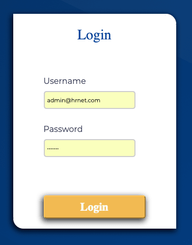

# HRnet is an application for create a new Employee:

This project is a Openclassroom project 14.

## Available Scripts

In the project directory, you can run:

### `npm start`

1. npm i 
2. npm start

Runs the app in the development mode.\
Open [http://localhost:3000](http://localhost:3000) to view it in the browser.

### For run application you need a login:

For Examples we have one Admin with login, you can find just below

Username | Password
-------- | --------
admin@hrnet.com | admin72

## We can access demo live directly here:

https://argent-bank-p14-openclassrooms.web.app/login

